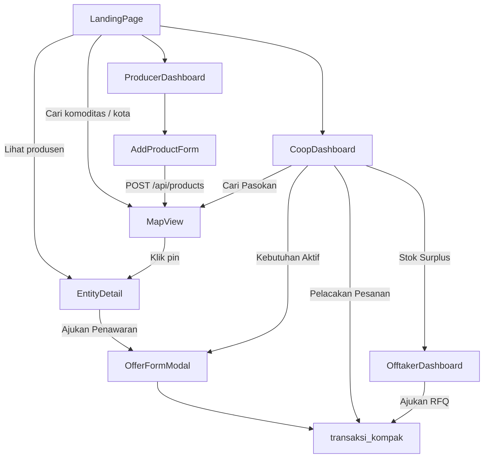
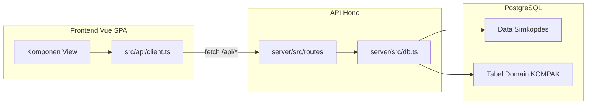

# KOMPAK Apps

**Optimalisasi Potensi Desa Melalui Koperasi** — *Satu Irama, Satu Data*

Platform web berbasis peta geospasial yang menghubungkan produsen komoditas desa (individu maupun komunitas RT/RW/Kelurahan) dengan **Koperasi Desa/Kelurahan Merah Putih** secara langsung, proaktif, dan dua arah.

> Hackathon Digital Cooperatives Expo 2026 — Tema 2 · Pilar 3 · Kemenkop RI × PEBS FEB UI

---

## Daftar Isi

1. [Tujuan & Hasil](#tujuan--hasil)
2. [Persona & Akun Demo](#persona--akun-demo)
3. [Alur Pengguna](#alur-pengguna)
4. [Fitur per Layar](#fitur-per-layar)
5. [Arsitektur](#arsitektur)
6. [Stack Teknologi](#stack-teknologi)
7. [Struktur Folder](#struktur-folder)
8. [API](#api)
9. [Database](#database)
10. [Setup Lokal](#setup-lokal)
11. [Deploy Production (Vercel + Supabase)](#deploy-production-vercel--supabase)
12. [Catatan Teknis](#catatan-teknis)
13. [Dokumen Terkait](#dokumen-terkait)

---

## Tujuan & Hasil

### Masalah

Produsen desa sering tidak tahu koperasi mana yang membutuhkan komoditas mereka, sehingga bergantung pada tengkulak. Di sisi lain, pengurus koperasi menghabiskan waktu dan biaya tinggi untuk mencari pasokan. Data pemasok dan kebutuhan tersebar, tidak terhubung secara visual maupun transaksional.

### Solusi KOMPAK

KOMPAK mengisi celah **pencocokan proaktif, distribusi, dan analitik** yang belum berjalan di ekosistem Simkopdes/CoopTrade — tanpa menggantikan infrastruktur yang sudah ada. Inti produk:

- **Peta komoditas dua arah** — produsen, komunitas, dan koperasi terlihat di satu peta interaktif
- **Matching berbasis jarak & komoditas** — filter komoditas, kota, radius GPS
- **Etalase digital** — profil terverifikasi dengan penawaran, kebutuhan, dan riwayat transaksi
- **Alur penawaran & transaksi** — ajukan penawaran, terima, jadwalkan pickup, simulasi pembayaran
- **Stok surplus & RFQ offtaker** — koperasi mempublikasikan surplus; pembeli eksternal mengajukan RFQ

### Hasil yang Diharapkan

| Hasil | Indikator |
|-------|-----------|
| Matching tanpa perantara | Produsen menemukan koperasi terdekat yang butuh komoditasnya |
| Transparansi distribusi | Status transaksi (deal, bayar, kirim) terlacak di dashboard |
| Data terbuka & terpercaya | Status verifikasi, rating, dan kapasitas tampil di etalase |
| Input ringan dari desa | Form tambah produk 3 langkah, bisa dari ponsel |

---

## Persona & Akun Demo

| Persona | Peran | ID Demo | Layar Utama |
|---------|-------|---------|-------------|
| **Pak Budi Santoso** | Produsen individu (gula aren, dll.) | `ENT-DEMO-PRODUCER-001` | Dashboard Produsen, Tambah Produk |
| **Pengurus Koperasi** | Mengelola kebutuhan & pesanan | `KOP-02AFA0134DB2` | Dashboard Koperasi |
| **PT Nusantara Food** | Offtaker / pembeli eksternal | `OFT-DEMO-001` | Dashboard Offtaker |
| **Komunitas RT/RW** | Produsen kolektif | entitas `tipe = komunitas` di peta | Peta, Etalase |

ID demo dapat di-override lewat environment variable:

```env
VITE_DEMO_PRODUCER_ID=ENT-DEMO-PRODUCER-001
VITE_DEMO_COOP_ID=KOP-02AFA0134DB2
VITE_DEMO_OFFTAKER_ID=OFT-DEMO-001
```

---

## Alur Pengguna



### Navigasi Aplikasi

Aplikasi **tidak memakai Vue Router**. Navigasi antar layar dikelola oleh `ref` di [`src/App.vue`](src/App.vue) melalui event `emit('navigate', view, data?)`.

| View ID | Komponen | Akses Navigasi |
|---------|----------|----------------|
| `home` | `LandingPage` | Beranda |
| `map` | `MapView` | Peta Komoditas |
| `producer-dashboard` | `ProducerDashboard` | Dashboard Produsen |
| `coop-dashboard` | `CoopDashboard` | Dashboard Koperasi |
| `offtaker-dashboard` | `OfftakerDashboard` | Dashboard Offtaker |
| `add-product` | `AddProductForm` | CTA produsen (nav aktif: Produsen) |
| `entity-detail` | `EntityDetail` | Klik pin di peta (nav aktif: Peta) |

Shell aplikasi dibungkus dalam portal bergaya Simkopdes ([`src/components/portal/SimkopdesShell.vue`](src/components/portal/SimkopdesShell.vue)).

---

## Fitur per Layar

### Beranda — `LandingPage`

- Hero dengan pencarian komoditas/kota → navigasi ke peta
- Statistik live (produsen, koperasi, komunitas, transaksi)
- Katalog komoditas & kartu produsen terdekat
- CTA daftar produsen dan eksplorasi peta

### Peta Komoditas — `MapView`

- Peta Leaflet satelit + marker cluster
- Pin: koperasi (biru), produsen (kuning), komunitas (hijau)
- Filter komoditas, toggle layer koperasi/komoditas
- Autocomplete kota (`GET /api/map/cities`)
- Klik pin → halaman detail entitas

### Dashboard Produsen — `ProducerDashboard`

- Metrik: produk aktif, transaksi, pendapatan
- Daftar penawaran komoditas + tombol **Tambah Produk**
- Rekomendasi koperasi terdekat yang membutuhkan komoditas serupa
- Ajukan penawaran ke koperasi
- Riwayat transaksi terbaru

### Dashboard Koperasi — `CoopDashboard`

Empat tab utama:

| Tab | Fungsi |
|-----|--------|
| **Kebutuhan Aktif** | Kelola & terima penawaran untuk kebutuhan komoditas |
| **Cari Pasokan** | Cari produsen by komoditas + radius GPS |
| **Pelacakan Pesanan** | Update status kirim, simulasi pembayaran |
| **Stok Surplus** | Publikasikan surplus untuk offtaker |

### Dashboard Offtaker — `OfftakerDashboard`

- Jelajahi stok surplus koperasi dan penawaran produsen
- Filter: Semua / Koperasi / Produsen
- Ajukan RFQ pembelian (`POST /api/offtaker/rfq`)

### Tambah Produk — `AddProductForm`

Form 3 langkah:

1. **Data Diri** — nama, telepon, lokasi
2. **Data Produk** — komoditas, jumlah, harga, foto, pin lokasi di peta
3. **Pratinjau** → submit `POST /api/products`

### Detail Entitas — `EntityDetail`

Etalase digital untuk produsen, komunitas, atau koperasi:

- Tentang, produk/kebutuhan, peta mini, rating
- Tombol **Ajukan Penawaran** via `OfferFormModal`

---

## Arsitektur

### Diagram Umum



### Lingkungan

| Lingkungan | Frontend | API | Database |
|------------|----------|-----|----------|
| **Lokal** | Vite `:5173` | Hono `:3001` via proxy | Docker Postgres `:5434` |
| **Production** | Vercel static `dist/` | Vercel serverless `api/index.ts` | Supabase Postgres |

### Alur Build Production

```
npm run build
  ├── vue-tsc + vite build  →  dist/          (SPA)
  └── scripts/build-api.mjs →  lib/api-app.mjs (bundle Hono)
        └── api/index.ts mengimpor bundle untuk Vercel serverless
```

Konfigurasi routing: [`vercel.json`](vercel.json) — `/api/*` → fungsi serverless, sisanya → `index.html`.

---

## Stack Teknologi

| Lapisan | Teknologi |
|---------|-----------|
| **Frontend** | Vue 3.5 (Composition API), Vite 6, TypeScript, Tailwind CSS 4 |
| **Peta** | Leaflet + leaflet.markercluster (imperatif, bukan react-leaflet) |
| **Ikon** | lucide-vue-next |
| **Backend** | Hono 4 (`server/` lokal, bundle untuk Vercel) |
| **Database** | PostgreSQL 16 via `postgres` (js) — tanpa ORM |
| **Lokal DB** | Docker Compose (`docker-compose.yml`) |
| **Production DB** | Supabase Postgres |
| **Deploy** | Vercel (SPA + serverless functions) |

**Tidak digunakan:** Vue Router, Pinia, Next.js, Supabase JS client (`@supabase/supabase-js`).

---

## Struktur Folder

```
kompak-apps/
├── src/                        # Frontend Vue SPA
│   ├── App.vue                 # Shell + view switcher + navbar
│   ├── main.ts
│   ├── api/                    # client.ts, types.ts
│   ├── components/             # Halaman fitur
│   │   ├── ui/                 # Primitif UI (Button, Tabs, Navbar, …)
│   │   └── portal/             # SimkopdesShell
│   ├── composables/            # useGeolocation, useInView
│   ├── styles/                 # globals.css, tokens, tailwind, fonts
│   └── imports/                # Dokumen UI/UX produk
│
├── server/                     # API Hono (development)
│   └── src/
│       ├── app.ts              # Mount semua route
│       ├── index.ts            # Node server + static uploads
│       ├── db.ts               # Koneksi Postgres
│       └── routes/               # stats, map, entities, dashboard, …
│
├── api/                        # Entry Vercel serverless
│   └── index.ts                # → lib/api-app.mjs
│
├── lib/                        # Output bundle API (generated, gitignored)
│
├── db/
│   ├── docker-init/            # Skema + seed saat Docker pertama kali jalan
│   │   ├── 01_schema.sql       # Skema Simkopdes
│   │   ├── 02_seed.sql         # Referensi ke dump SQL
│   │   ├── 03_kompak_entities.sql
│   │   └── 04_kompak_seed.sql
│   ├── migrations/             # 05–08 migrasi fitur KOMPAK
│   └── *.sql                   # Dump data koperasi (profil, produk, wilayah, …)
│
├── scripts/
│   ├── build-api.mjs           # Bundle Hono → lib/api-app.mjs
│   ├── supabase-init.mjs       # Seed skema + data ke Supabase
│   └── verify-api.mjs          # Cek /api/health & /api/map/pins
│
├── docker-compose.yml
├── vercel.json
├── vite.config.ts
└── .env.example
```

Alias import: `@/` → `src/` (dikonfigurasi di `vite.config.ts`).

---

## API

Semua endpoint diawali `/api`. Klien frontend: [`src/api/client.ts`](src/api/client.ts). Definisi route: [`server/src/app.ts`](server/src/app.ts).

### Kesehatan & Diagnostik

| Method | Path | Deskripsi |
|--------|------|-----------|
| `GET` | `/api/health` | Liveness check |
| `GET` | `/api/db-check` | Cek skema & jumlah data di database |

### Data Publik

| Method | Path | Deskripsi |
|--------|------|-----------|
| `GET` | `/api/stats` | Statistik landing page |
| `GET` | `/api/commodities` | Katalog komoditas |
| `GET` | `/api/map/pins?lat=&lng=` | Pin peta + kartu produsen |
| `GET` | `/api/map/cities?q=` | Autocomplete kota |
| `GET` | `/api/entities/:type/:id` | Detail etalase entitas |

### Dashboard

| Method | Path | Deskripsi |
|--------|------|-----------|
| `GET` | `/api/dashboard/producer/:id` | Data dashboard produsen |
| `GET` | `/api/dashboard/coop/:id` | Data dashboard koperasi |
| `GET` | `/api/offtaker/dashboard/:id` | Data dashboard offtaker |

### Produk & Penawaran

| Method | Path | Deskripsi |
|--------|------|-----------|
| `POST` | `/api/products` | Tambah/update penawaran komoditas |
| `POST` | `/api/uploads` | Upload foto produk |
| `POST` | `/api/offers` | Ajukan penawaran (`respon_penawaran`) |
| `GET` | `/api/offers` | Daftar penawaran |
| `POST` | `/api/offers/:id/accept` | Terima penawaran → buat transaksi |

### Transaksi & Offtaker

| Method | Path | Deskripsi |
|--------|------|-----------|
| `POST` | `/api/orders` | Jadwalkan pickup |
| `PATCH` | `/api/orders/:id` | Update status pengiriman |
| `POST` | `/api/orders/:id/pay-simulate` | Simulasi pembayaran |
| `POST` | `/api/offtaker/rfq` | Ajukan RFQ pembelian |
| `GET` | `/api/offtaker/rfq` | Daftar RFQ |
| `POST` | `/api/offtaker/rfq/:id/accept` | Terima RFQ → transaksi |
| `POST` | `/api/offtaker/surplus` | Publikasikan stok surplus koperasi |

### Proxy Development

Vite mem-proxy `/api` dan `/uploads` ke `http://localhost:3001` (lihat [`vite.config.ts`](vite.config.ts)).

---

## Database

### Dua Lapisan Data

**1. Data Simkopdes (basis)** — dari dump resmi koperasi:

| Tabel | Isi |
|-------|-----|
| `referensi_wilayah` | Provinsi, kab/kota, kecamatan, desa |
| `profil_koperasi` | Nama, status, alamat, koordinat |
| `referensi_koperasi_wilayah` | Relasi koperasi ↔ wilayah |
| `produk_koperasi`, `anggota_koperasi`, dll. | Data operasional koperasi |

**2. Domain KOMPAK** — tabel aplikasi pencocokan:

| Tabel | Isi |
|-------|-----|
| `entitas_komoditas` | Produsen & komunitas (pin peta) |
| `penawaran_komoditas` | Penawaran jual produsen |
| `kebutuhan_koperasi` | Permintaan komoditas koperasi |
| `respon_penawaran` | Penawaran dua arah produsen ↔ koperasi |
| `transaksi_kompak` | Deal, status bayar & kirim |
| `offtaker` | Pembeli eksternal |
| `stok_surplus_koperasi` | Surplus koperasi untuk offtaker |
| `rfq_offtaker` | Request for Quotation dari offtaker |

### Urutan Inisialisasi

**Lokal (Docker):** otomatis saat container pertama kali dibuat via `db/docker-init/`.

**Supabase (production):**

```bash
DATABASE_URL="postgresql://..." npm run db:supabase-init
```

Skrip [`scripts/supabase-init.mjs`](scripts/supabase-init.mjs) menjalankan:

1. Skema Simkopdes (`01_schema.sql` + dump data) — jika belum ada
2. Tabel domain KOMPAK (`03_kompak_entities.sql`)
3. Seed entitas & transaksi demo (`04_kompak_seed.sql`)
4. Migrasi incremental (`db/migrations/05`–`08`)

Hasil seed tipikal: **~1.026 koperasi**, **~400 entitas** (produsen + komunitas).

---

## Setup Lokal

### Prasyarat

- Node.js 20+
- Docker & Docker Compose

### Langkah

```bash
# 1. Clone & install
git clone https://github.com/fauzan05/kompak-apps.git
cd kompak-apps
npm install
npm install --prefix server

# 2. Environment
cp .env.example .env

# 3. Database
docker compose up -d
# Postgres tersedia di localhost:5434
# Skema + seed otomatis dari db/docker-init/

# 4. Jalankan frontend + API bersamaan
npm run dev:all
# Frontend: http://localhost:5173
# API:      http://localhost:3001

# 5. Verifikasi API
npm run verify:api
```

### Scripts NPM

| Script | Fungsi |
|--------|--------|
| `npm run dev` | Vite dev server saja |
| `npm run dev:api` | Hono API saja |
| `npm run dev:all` | Frontend + API bersamaan |
| `npm run build` | Build SPA + bundle API |
| `npm run db:supabase-init` | Seed database Supabase |
| `npm run verify:api` | Cek endpoint API |

---

## Deploy Production (Vercel + Supabase)

### 1. Environment Variables di Vercel

Set untuk **Production** dan **Preview**:

```env
DATABASE_URL=postgresql://postgres.<ref>:<password-encoded>@<host>.pooler.supabase.com:5432/postgres
```

Atau andalkan `POSTGRES_URL` dari integrasi Supabase → Vercel (disarankan).

> **Penting:** Jika password mengandung `#` atau `*`, wajib URL-encode (`#` → `%23`, `*` → `%2A`). Variabel `NEXT_PUBLIC_SUPABASE_*` **tidak dipakai** aplikasi ini.

### 2. Seed Database Supabase (sekali)

```bash
DATABASE_URL="postgresql://..." npm run db:supabase-init
```

### 3. Deploy

Push ke branch `main` → Vercel otomatis build & deploy.

Build menghasilkan:
- `dist/` — static SPA
- `lib/api-app.mjs` — bundle API serverless

### 4. Verifikasi

```bash
# Cek kesehatan
curl https://<app>.vercel.app/api/health
# → {"ok":true}

# Cek database
curl https://<app>.vercel.app/api/db-check
# → {"ok":true,"counts":{"koperasi":1026,"entitas":400}}

# Verifikasi lengkap
API_BASE=https://<app>.vercel.app npm run verify:api
```

---

## Catatan Teknis

| Topik | Detail |
|-------|--------|
| **Navigasi** | View switcher di `App.vue`, bukan Vue Router |
| **Peta** | Leaflet imperatif di `MapView.vue`, bukan wrapper React/Vue |
| **Koneksi DB** | `postgres` js langsung; SSL otomatis untuk host `supabase.com` |
| **Upload file** | `POST /api/uploads` menyimpan ke `server/uploads/` — **ephemeral** di Vercel serverless |
| **Pooler** | Port `5432` (session) atau `6543` (transaction) untuk Supabase pooler |
| **Demo IDs** | Hardcoded default di `src/api/client.ts` & `server/src/db.ts`, override via env |

---

## Dokumen Terkait

- [Dokumen UI/UX lengkap](src/imports/KOMPAK_Apps_Dokumen_UIUX.md) — persona, wireframe, sistem desain, prioritas fitur
- [Environment variables](.env.example) — daftar env yang dibutuhkan
- [Aturan proyek Cursor](.cursor/rules/kompak-project.mdc) — konvensi coding

---

## Lisensi

Proyek privat — Hackathon Digital Cooperatives Expo 2026, Tim KOMPAK Apps.
